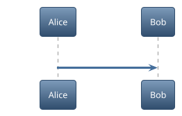

<p align="center">
<br><br><br>

<br><br><br>
</p>

# mo

[](https://github.com/k1LoW/mo/actions/workflows/ci.yml)   

`mo` is a **M**arkdown viewer that **o**pens `.md` files in a browser.

## Features

- GitHub-flavored Markdown (tables, task lists, footnotes, etc.)
- Syntax highlighting ([Shiki](https://shiki.style/))
- [Mermaid](https://mermaid.js.org/) diagram rendering
- [PlantUML](https://plantuml.com/) diagram rendering
- LaTeX math rendering ([KaTeX](https://katex.org/))
- [GitHub Alerts](https://docs.github.com/en/get-started/writing-on-github/getting-started-with-writing-and-formatting-on-github/basic-writing-and-formatting-syntax#alerts) (admonitions)
- Fullscreen zoom modal for images, Mermaid diagrams, and PlantUML diagrams
-  Dark /  light theme
-  File grouping
-  Table of contents panel
-  Flat /  tree sidebar view with drag-and-drop reorder
-  File name /  heading title sidebar display toggle (per-group)
-  Full-text search across file names and content
- YAML frontmatter display (collapsible metadata block)
- MDX file support (renders as Markdown, strips `import`/`export`, escapes JSX tags)
-  Content font size toggle (small / medium / large / extra large)
-  Wide /  narrow content width toggle
-  Raw markdown view
-  Copy content (Markdown / Text / HTML)
-  Server restart with session preservation
- Auto session backup and restore
- Drag-and-drop file addition from the OS file manager (content is loaded in-memory; live-reload is not supported for dropped files)
- Stdin pipe support (`cat file.md | mo`)
- Live-reload on save (for files opened via CLI)

## Install

**homebrew tap:**

```console
$ brew install k1LoW/tap/mo
```

**manually:**

Download binary from [releases page](https://github.com/k1LoW/mo/releases)

## Usage

``` console
$ mo README.md                          # Open a single file
$ mo README.md CHANGELOG.md docs/*.md   # Open multiple files
$ mo docs/                              # Open all .md files in a directory
$ mo spec.md --target design            # Open in a named group
$ cat notes.md | mo                     # Read Markdown from stdin
```

`mo` opens Markdown files in a browser with live-reload. When you save a file, the browser automatically reflects the changes.

### Reading from stdin

When no positional arguments are given and stdin is redirected (not a terminal), `mo` reads Markdown content from stdin.

``` console
$ cat notes.md | mo
$ some-command | mo --target output
$ mo < notes.md
```

The content is loaded in-memory with a generated name (`stdin-<hash>.md`). Piping the same content again reuses the existing entry (deduplicated by content hash).

### PlantUML diagrams

`mo` renders fenced `plantuml` and `puml` code blocks through the public PlantUML SVG server. In dark mode, it switches the PlantUML server output format from `/svg/` to `/dsvg/`, but it does not inject or override diagram themes.

Declare visual themes in the Markdown source so diagrams render consistently across tools:



For C4-PlantUML diagrams, use a C4-compatible theme before including the C4 library:

```plantuml
@startuml
!theme C4_blue_new from <C4/themes>
!include <C4/C4_Context>

Person(user, "User")
System(system, "System")
Rel(user, system, "Uses")
@enduml
```

The C4 `!theme` line must appear before the C4 `!include` line because C4-PlantUML defines its own colors and relationship styles.

### Single server, multiple files

By default, `mo` runs a single server on port `6275`. If a server is already running on the same port, subsequent `mo` invocations add files to the existing session instead of starting a new one.

``` console
$ mo README.md          # Starts a mo server in the background
$ mo CHANGELOG.md       # Adds the file to the running mo server
```

To run a completely separate session, use a different port:

``` console
$ mo draft.md -p 6276
```


### Groups

Files can be organized into named groups using the `--target` (`-t`) flag. Each group gets its own URL path and sidebar.

``` console
$ mo spec.md --target design      # Opens at http://localhost:6275/design
$ mo api.md --target design       # Adds to the "design" group
$ mo notes.md --target notes      # Opens at http://localhost:6275/notes
```


### Watch mode and glob patterns

`--watch` (`-w`) turns on watch mode. Directory and glob positional arguments are registered as watch patterns, matching files are opened, and new matching files are picked up automatically.

``` console
$ mo -w '**/*.md'                              # Watch and open all .md files recursively
$ mo -w 'docs/**/*.md' --target docs           # Watch docs/ tree in "docs" group
$ mo -w '*.md' 'docs/**/*.md'                  # Multiple patterns (positional)
$ mo -w docs/                                  # Watch docs/*.md
```

Combine with `--recursive` (`-R`) to descend into subdirectories. Short flags can be combined:

``` console
$ mo -w -R docs/                               # Watch docs/**/*.md
$ mo -wR docs/                                 # Same, short-combined
```

Without `--watch`, globs are expanded once and directory arguments open matching files without live-watching new additions:

``` console
$ mo docs/                                     # Open every .md directly in docs/
$ mo -R docs/                                  # Open every .md under docs/ (recursive)
$ mo 'docs/*.md'                               # Expand and open matching .md files
```

#### Removing watch patterns

`--unwatch` removes previously registered patterns. Pass glob patterns or directories as positional arguments to specify which patterns to remove. Regular file paths are not accepted (use `--close` to remove individual files from the sidebar). Files already added by a pattern remain in the sidebar.

``` console
$ mo --unwatch '**/*.md'                              # Stop watching a pattern (default group)
$ mo --unwatch docs/                                  # Stop watching docs/*.md
$ mo --unwatch 'docs/**/*.md' --target docs            # Stop watching in a specific group
```

With `-R`, a directory argument removes **all** registered patterns under that directory at once. For example, if `docs/*.md`, `docs/sub/*.md`, and `docs/**/*.md` are all registered, a single command removes them all:

``` console
$ mo --unwatch -R docs/                               # Removes docs/*.md, docs/sub/*.md, docs/**/*.md, etc.
```

Patterns are resolved to absolute paths before matching, so you can specify either a relative glob or the full path shown by `--status`.

### Sidebar view modes

The sidebar supports flat and tree view modes. Flat view shows file names only, while tree view displays the directory hierarchy.

|  Flat |  Tree |
|------|------|
|  |  |

### Starting and stopping

`mo` runs in the background by default — the command returns immediately, leaving the shell free for other work. This makes it easy to incorporate into scripts, tool chains, or LLM-driven workflows.

``` console
$ mo README.md
mo: serving at http://localhost:6275 (pid 12345)
$ # shell is available immediately
```

Use `--status` to check all running mo servers, and `--shutdown` to stop one:

``` console
$ mo --status              # Show all running mo servers
http://localhost:6275 (pid 12345, v0.12.0)
  default: 5 file(s)
    watching: /Users/you/project/src/**/*.md, /Users/you/project/*.md
  docs: 2 file(s)
    watching: /Users/you/project/docs/**/*.md

$ mo --shutdown            # Shut down the mo server on the default port
$ mo --shutdown -p 6276    # Shut down the mo server on a specific port
$ mo --restart             # Restart the mo server on the default port
```

If you need the mo server to run in the foreground (e.g. for debugging), use `--foreground`:

``` console
$ mo --foreground README.md
```

### Server restart

Click the  restart button (bottom-right corner) or run `mo --restart` to restart the `mo` server process. The current session — all open files and groups — is preserved across the restart. This is useful when you have updated the `mo` binary and want to pick up the new version without re-opening your files.

### Session backup and restore

`mo` automatically saves session state (open files and watch patterns per group) when files are added or removed. When starting a new server, the previous session is automatically restored and merged with any files specified on the command line. Restored session entries appear first, followed by newly specified files.

``` console
$ mo README.md CHANGELOG.md       # Start with two files
$ mo --shutdown                   # Shut down the server
$ mo                              # Restores README.md and CHANGELOG.md
$ mo TODO.md                      # Restores previous session + adds TODO.md
```

Use `--close` to remove specific files from the running server:

``` console
$ mo --close README.md            # Close a file from the default group
$ mo --close docs/*.md -t docs    # Close files from the "docs" group
```

Use `--clear` to remove a saved session. If a server is running, it is automatically restarted with an empty state:

``` console
$ mo --clear                      # Clear saved session for the default port
$ mo --clear -p 6276              # Clear saved session for a specific port
```

### JSON output

Use `--json` to get structured JSON output on stdout, useful for scripting and integration with other tools.

``` console
$ mo --json README.md
{
  "url": "http://localhost:6275",
  "files": [
    {
      "url": "http://localhost:6275/?file=a1b2c3d4",
      "name": "README.md",
      "path": "/Users/you/project/README.md"
    }
  ]
}
```

`--status` also supports `--json`:

``` console
$ mo --status --json
[
  {
    "url": "http://localhost:6275",
    "status": "running",
    "pid": 12345,
    "version": "0.15.0",
    "revision": "abc1234",
    "groups": [
      {
        "name": "default",
        "files": 3,
        "patterns": ["**/*.md"]
      }
    ]
  }
]
```

### Flags

| Flag | Short | Default | Description |
|------|-------|---------|-------------|
| `--target` | `-t` | `default` | Group name |
| `--port` | `-p` | `6275` | Server port |
| `--bind` | `-b` | `localhost` | Bind address (e.g. `0.0.0.0`) |
| `--open` | | | Always open browser |
| `--no-open` | | | Never open browser |
| `--status` | | | Show all running mo servers |
| `--watch` | `-w` | `false` | Treat directory and glob arguments as watch patterns |
| `--unwatch` | | `false` | Remove watched patterns for the given directory or glob arguments |
| `--recursive` | `-R` | `false` | Recurse into subdirectories when a directory is given |
| `--close` | | | Close files instead of opening them |
| `--shutdown` | | | Shut down the running mo server |
| `--restart` | | | Restart the running mo server |
| `--clear` | | | Clear saved session (restarts server if running) |
| `--foreground` | | | Run mo server in foreground |
| `--json` | | | Output structured data as JSON to stdout |
| `--dangerously-allow-remote-access` | | | Allow remote access without authentication (trusted networks only) |

> [!WARNING]
> Binding to a non-localhost address exposes mo to the network **without any authentication**. Remote clients can read any file accessible by the user, browse the filesystem via glob patterns, and shut down the server. A confirmation prompt is shown when `--bind` is set to a non-loopback address.

## Build

Requires Go and [pnpm](https://pnpm.io/).

``` console
$ make build
```

## References

- [yusukebe/gh-markdown-preview](https://github.com/yusukebe/gh-markdown-preview): GitHub CLI extension to preview Markdown looks like GitHub.

## License

- [MIT License](LICENSE)
    - Include logo as well as source code.
    - Only logo license can be selected [CC BY 4.0](https://creativecommons.org/licenses/by/4.0/).
    - Also, if there is no alteration to the logo and it is used for technical information about mo, I would not say anything if the copyright notice is omitted.
